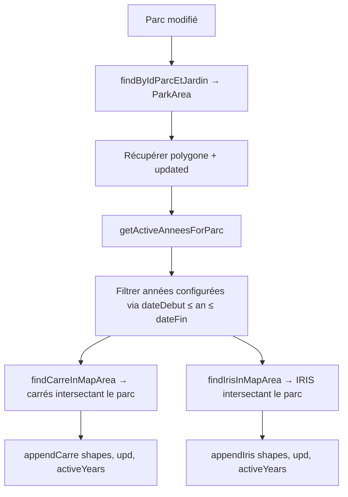
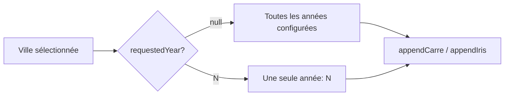
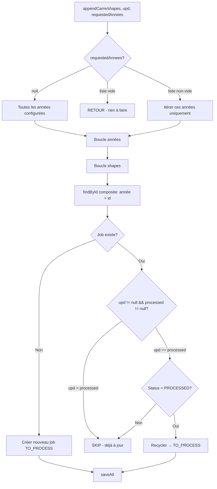
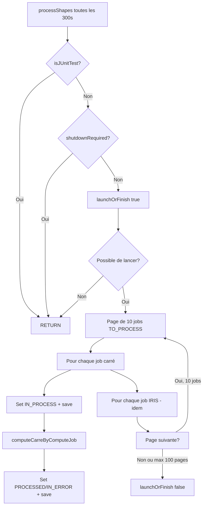
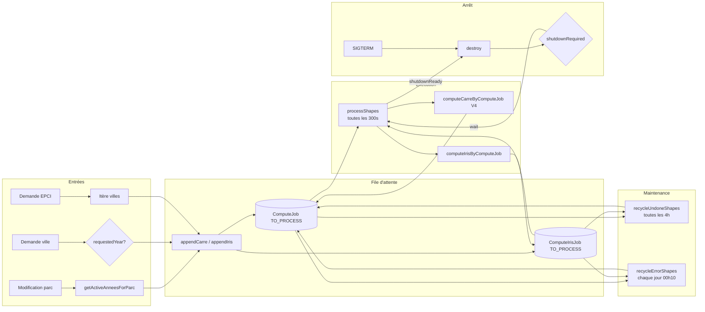

# BatchJobService — Processus de calcul par lots

## 1. Vue d'ensemble

`BatchJobService` orchestre le calcul des carreaux INSEE 200m et des IRIS. Il gère :

- **La file d'attente** : création et mise à jour des jobs (`ComputeJob`, `ComputeIrisJob`)
- **L'exécution** : traitement séquentiel par `@Scheduled` toutes les 300s
- **Le recyclage** : réparation des jobs bloqués ou en erreur
- **L'arrêt gracieux** : `DisposableBean` avec `shutdownRequired` / `shutdownReady`

## 2. Modèles de données

### 2.1 `ComputeJob` — job carreau 200m

Stocké dans `compute_job`. Clé composite :

| Champ | Type | Rôle |
|---|---|---|
| `annee` | `Integer` | Année INSEE (ex: 2015, 2017, 2019, 2021) |
| `idInspire` | `String` | Identifiant Inspire du carreau 200m |
| `demand` | `Date` | Date de demande du traitement |
| `processed` | `Date` | Date de dernier traitement effectif |
| `status` | `ComputeJobStatusEnum` | `TO_PROCESS` \| `IN_PROCESS` \| `PROCESSED` \| `IN_ERROR` |
| `codeInsee` | `String` | Code INSEE de la commune |

### 2.2 `ComputeIrisJob` — job IRIS

Même structure avec `iris` au lieu de `idInspire`. Stocké dans `compute_iris_job`.

### 2.3 `ComputeJobStatusEnum`

| Valeur | Code | Signification |
|---|---|---|
| `TO_PROCESS` | 0 | En attente dans la file |
| `IN_PROCESS` | 1 | En cours de traitement |
| `PROCESSED` | 2 | Terminé avec succès |
| `IN_ERROR` | 3 | Terminé en erreur |

## 3. Entrées — création des jobs

Trois points d'entrée créent des jobs dans la file d'attente.

### 3.1 Sur modification d'un parc : `requestProcessParc(ParcEtJardin)`



**Nouveau** : `getActiveAnneesForParc(pj)` filtre les années configurées (`application.business.insee.annees`) selon le cycle de vie du parc :

- Si `dateDebut` est null → actif depuis 1900 (toujours)
- Si `dateFin` est null → actif jusqu'en 2100 (toujours)
- Sinon `dateDebut.annee ≤ année ≤ dateFin.annee`

**Exemple** :

| dateDebut | dateFin | Années configurées | Années actives |
|---|---|---|---|
| null | null | 2015, 2017, 2019, 2021 | 2015, 2017, 2019, 2021 |
| 2018-03-01 | 2020-11-15 | 2015, 2017, 2019, 2021 | 2019 |
| 2000-01-01 | 2016-12-31 | 2015, 2017, 2019, 2021 | 2015 |
| 2016-06-01 | null | 2015, 2017, 2019, 2021 | 2017, 2019, 2021 |

**Avant optimisation** : `appendCarre` recevait `null` (toutes les années) même pour un parc actif 2018-2020 (inutile de check 2015 et 2021).

### 3.2 Sur demande ville : `requestProcessCity(inseeCode, requestedYear)`



Utilisé pour le déclenchement manuel depuis l'interface admin (par commune ou EPCI). Pas de filtre cycle de vie (les années sont passées explicitement).

### 3.3 Sur demande EPCI : `requestProcessCom2Co(com2co, requestedYear)`

Itère sur les villes de l'EPCI et appelle `requestProcessCity` pour chacune.

## 4. Méthodes factorisées : `appendCarre` / `appendIris`

Ces deux méthodes ont la même logique :



### 4.1 Détermination des années à traiter

```java
List<Integer> annes;
if (requestedAnnees != null && !requestedAnnees.isEmpty()) {
    annes = requestedAnnees;                     // liste explicite
} else if (requestedAnnees != null && requestedAnnees.isEmpty()) {
    return;                                      // skip si vide
} else {
    Integer[] cfg = applicationBusinessProperties.getInseeAnnees();
    annes = cfg != null ? Arrays.asList(cfg) : List.of();  // toutes
}
```

### 4.2 Filtre date de mise à jour (inchangé)

Pour chaque (année, carré) existant déjà en base :

```java
boolean skip = upd != null && job.getProcessed() != null 
    ? upd.before(job.getProcessed()) : false;
```

- Si `upd` est null (cas ville/EPCI) → skip = false (toujours recalculer)
- Si `job.processed` est null → skip = false (jamais traité)
- Si `upd < processed` → la donnée parc n'a pas changé depuis le dernier calcul → skip
- Si `upd >= processed` → le parc a changé → on recalcule

### 4.3 Résumé des décisions

| Job existe ? | upd < processed ? | Status = PROCESSED ? | Action |
|---|---|---|---|
| Non | — | — | Créer nouveau TO_PROCESS |
| Oui | Oui | — | SKIP (continue) |
| Oui | Non | Oui | Recycler TO_PROCESS |
| Oui | Non | Non (IN_PROCESS/ERROR) | SKIP (continue) |

## 5. Exécution : `processShapes()`



### 5.1 Ordonnancement

```java
@Scheduled(fixedDelay = 300, initialDelay = 60, timeUnit = TimeUnit.SECONDS)
```

- Toutes les 5 minutes (300s)
- Premier démarrage après 60s
- Traite par lots de 10 jobs, max 100 itérations (1000 jobs/cycle max)

### 5.2 Ordre de traitement

- **Dev** (`P20230205`) : `ORDER BY demand DESC` — priorité aux plus récents
- **Prod** : `ORDER BY demand ASC` — priorité aux plus anciens (FIFO)

### 5.3 Exclusion mutuelle

`launchOrFinish(true/false)` verrouille le traitement :

- Un seul thread `processShapes` à la fois (`synchronized` sur `jobIsRunning`)
- Si un cycle est déjà en cours, le suivant est ignoré
- Libéré quand le cycle termine

## 6. Recyclage : jobs bloqués ou en erreur

### 6.1 `recycleUndoneShapes` — toutes les 4h (cron : `0 15 */4 * *`)

Cherche les jobs en statut `IN_PROCESS` depuis plus de 8h15 :
- Fenêtre : `oldDate = maintenant - 8h15`
- Requête : `findOnStartUnfinishedProcessed(oldDate)`
- Action : reset à `TO_PROCESS` avec nouvelle date de demande

### 6.2 `recycleErrorShapes` — quotidien à 00h10 (cron : `0 10 0 * *`)

Cherche les jobs en statut `IN_ERROR` depuis la veille :
- Fenêtre : `oldDate = maintenant - 1 jour`
- Requête : `findOnErrorAndProcessed(oldDate)`
- Action : reset à `TO_PROCESS` avec nouvelle date de demande

## 7. Arrêt gracieux

`BatchJobService implements DisposableBean` :

1. `destroy()` appelé au SIGTERM
2. Pose `shutdownRequired = true`
3. Boucle d'attente tant que `jobIsRunning && !shutdownReady`
4. Les méthodes `appendCarre/appendIris/proccessShapes` vérifient `shutdownRequired` et positionnent `shutdownReady`
5. Sortie propre quand le job en cours se termine

## 8. Optimisations appliquées

### 8.1 Filtre cycle de vie du parc (NOUVEAU)

Dans `requestProcessParc`, `getActiveAnneesForParc(pj)` remplace `null` par la liste des années où le parc était actif. Les années hors cycle de vie ne sont pas parcourues du tout.

### 8.2 Filtre date de mise à jour (EXISTANT)

Évite de recréer un job si le job existant a déjà été traité après la dernière modification du parc.

### 8.3 Signature `List<Integer>` (NOUVEAU)

`appendCarre` et `appendIris` acceptent maintenant `List<Integer>` au lieu d'un `Integer` unique, permettant de passer un sous-ensemble d'années arbitraire.

## 9. Diagramme de flux complet



## 10. Fichiers sources

| Fichier | Rôle |
|---|---|
| `BatchJobService.java` | Orchestrateur du batch |
| `ComputeJob.java` | Modèle job carreau 200m |
| `ComputeIrisJob.java` | Modèle job IRIS |
| `ComputeJobStatusEnum.java` | États des jobs |
| `ComputeJobRepository.java` | Accès DB jobs carreau |
| `ComputeJobIrisRepository.java` | Accès DB jobs IRIS |
| `ComputeCarreServiceV4.java` | Calcul carreau (implémentation) |
| `ComputeCarreServiceV3.java` | Calcul carreau (référence) |
| `IComputeCarreService.java` | Interface calcul carreau |
| `ParkArea.java` | Zone isochrone d'un parc |
| `ParcEtJardin.java` | Données du parc (dates cycle de vie) |
| `ApplicationBusinessProperties.java` | Config (années INSEE, seuils OMS) |
