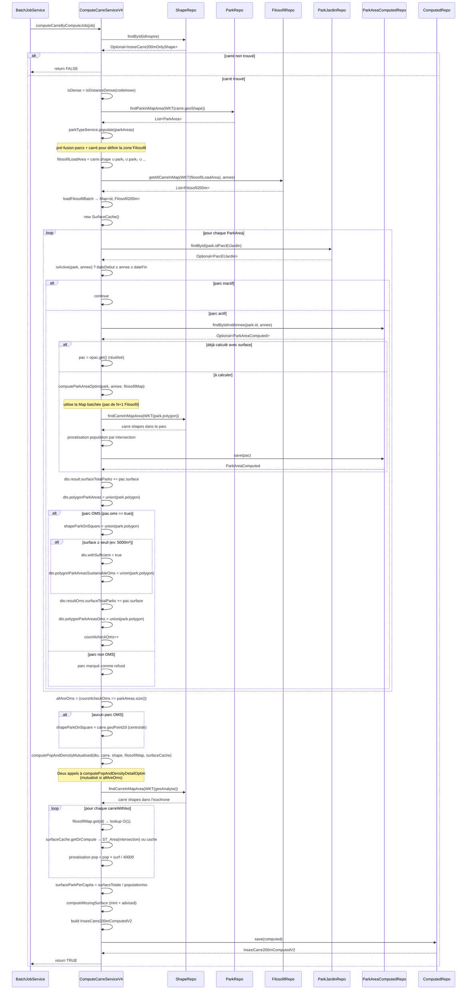

# ComputeCarreServiceV4 — Documentation technique

## 1. Vue d'ensemble

`ComputeCarreServiceV4` est la version optimisée du service de calcul des métriques
des carrés INSEE 200m. Elle remplace `ComputeCarreServiceV3` à l'activation du toggle
`application.feature-flipping.carre200m-impl=v4`.

**Objectif** : réduire les requêtes SQL redondantes, batcher les accès aux données
de population, et mutualiser les calculs entre les périmètres "tous parcs" et "parcs OMS".

Contrat fonctionnel (inchangé par rapport à V3) :
- Pour un carreau INSEE 200m et une année donnés, calculer la surface de parc
  accessible par habitant (en m²/hab), les indicateurs OMS correspondants,
  et les surfaces manquantes pour atteindre les normes.
- Un "carreau" est une maille carrée de 200m × 200m (40 000 m²).

---

## 2. Architecture

### 2.1 Interface

Le service implémente `IComputeCarreService` :

```
IComputeCarreService
├── computeCarreByComputeJob(ComputeJob) → Boolean
├── refreshParkEntrances(String)          // par code INSEE
├── refreshParkEntrances(Cadastre)        // par entité cadastre
├── computeParkArea(ParkArea) → ParkAreaComputed
└── getSurface(Geometry) → Long
```

Trois implémentations coexistent, activées par `@ConditionalOnProperty` :
- `ComputeServiceV2` (obsolète) : `carre200m-impl=v2`
- `ComputeCarreServiceV3` (stable) : `carre200m-impl=v3` (défaut)
- `ComputeCarreServiceV4` (optimisée) : `carre200m-impl=v4`

### 2.2 Dépendances injectées

| Dépendance | Rôle |
|---|---|
| `ApplicationBusinessProperties` | Seuils OMS, années INSEE, surfaces minimales |
| `ParkAreaRepository` | Recherche spatiale des parcs intersectant une zone |
| `ParkAreaComputedRepository` | CRUD des métriques calculées par parc |
| `InseeCarre200mComputedV2Repository` | CRUD du résultat final par carreau |
| `CityRepository` | Commune associée à un code INSEE |
| `CadastreRepository` | Données cadastrales |
| `Filosofil200mRepository` | Données de population Filosofil (batch) |
| `InseeCarre200mOnlyShapeRepository` | Géométrie des carreaux + `ST_Area` |
| `ParkJardinRepository` | Données des parcs et jardins (dates, surfaces) |
| `ServiceOpenData` | Distance piétonne selon la densité |
| `ParkTypeService` | Typologie OMS des parcs |
| `ParkService` | Recalcul des isochrones d'entrée |

### 2.3 Structure de données

**`ComputeDto`** — DTO de travail, construit par job :

| Champ | Type | Rôle |
|---|---|---|
| `annee` | `Integer` | Année traitée |
| `isDense` | `Boolean` | Zone dense ou périurbaine |
| `popAll` | `BigDecimal` | Population totale du carreau courant |
| `polygonParkAreas` | `Geometry` | Union des polygones de TOUS les parcs |
| `result` | `ComputeResultDto` | Résultat "tous parcs" |
| `polygonParkAreasOms` | `Geometry` | Union des polygones des parcs OMS |
| `resultOms` | `ComputeResultDto` | Résultat "parcs OMS seulement" |
| `polygonParkAreasSustainableOms` | `Geometry` | Union des polygones des parcs OMS durables (≥ seuil) |
| `withSufficient` | `Boolean` | Au moins un parc OMS atteint le seuil de surface |
| `popWithSufficient` | `BigDecimal` | Population avec accès à un parc durable |
| `allAreOms` | `Boolean` | Tous les parcs du carreau sont OMS |
| `parcNames` / `parcName` | `List<String>` / `String` | Noms des parcs (commentaire HTML) |

**`ComputeResultDto`** — Résultat d'un périmètre de calcul :

| Champ | Type | Rôle |
|---|---|---|
| `surfaceTotalParks` | `BigDecimal` | Somme des surfaces des parcs du périmètre (m²) |
| `populationInIsochrone` | `BigDecimal` | Population totale dans l'isochrone |
| `surfaceParkPerCapita` | `BigDecimal` | Surface par habitant (m²/hab) |
| `popInc` | `BigDecimal` | Population ayant accès à un parc (prorata surface) |
| `popExc` | `BigDecimal` | Population sans accès parc (prorata surface) |

**`InseeCarre200mComputedV2`** — Entité persistée en sortie :

| Champ | Rôle |
|---|---|
| `annee` + `idInspire` | Clé composite |
| `surfaceTotalPark` / `surfaceTotalParkOms` | Surfaces totales (tous / OMS) |
| `populationInIsochrone` / `populationInIsochroneOms` | Populations dans l'isochrone |
| `surfaceParkPerCapita` / `surfaceParkPerCapitaOms` | m²/hab (tous / OMS) |
| `popIncluded` / `popExcluded` (+ OMS) | Population avec/sans accès |
| `missingSurfaceMini` / `missingSurfaceAdvised` | Surface manquante pour atteindre les normes OMS |
| `isSustainablePark` / `populationWithSustainablePark` | Indicateur de parc durable (≥ 5000m² à 300m) |
| `isDense` | Zone dense |
| `comments` | Liste HTML des parcs |

---

## 3. Algorithme principal : `computeCarreByComputeJob`

### 3.1 Diagramme de séquence



### 3.2 Phases détaillées

#### Phase 1 — Recherche des parcs

```
findParkInMapArea(WKT(carre.geoShape))
```

Interroge PostGIS (`ST_Intersects`) pour trouver tous les `ParkArea` dont le polygone
intersecte le carreau. Les parcs sont ensuite enrichis par `parkTypeService.populate()`
(type OMS, etc.).

> [!NOTE]
> La méthode `compute(ComputeDto, InseeCarre200mOnlyShape)` n'a pas ce problème car
> elle reçoit un `ComputeDto` déjà préparé par l'appelant, dont `polygonParkAreas`
> contient déjà l'union complète des polygones des parcs.

#### Phase 2 — Charge batch Filosofil

```java
// Pré-fusion des polygones des parcs + carré pour définir la zone de requête
Geometry filosofilLoadArea = carre.getGeoShape();
for (ParkArea parkArea : parkAreas) {
    filosofilLoadArea = filosofilLoadArea.union(parkArea.getPolygon());
}
Map<String, Filosofil200m> filosofilMap = loadFilosofilBatch(
    GeometryQueryHelper.toText(filosofilLoadArea), annee);
```

Une seule requête SQL avec `getAllCarreInMap(wkt, annee)` qui réalise un JOIN spatial
entre `carre200onlyshape` et `filosofi_200m` pour l'année donnée. Résultat indexé
dans une `HashMap<idInspire, Filosofil200m>` pour accès O(1).

**Zone de chargement** : la zone de requête Filosofil est l'union du carré courant
ET de tous les polygones des parcs intersectant ce carré. C'est essentiel car :
- Chaque parc a une zone d'influence (isochrone piéton : 300m en zone dense, 1 200m
  en périurbain) qui s'étend bien au-delà du carré de 200m.
- Les carreaux situés dans cette zone d'influence mais hors du carré courant doivent
  avoir leurs données de population chargées pour les calculs de proratisation.
- Dans V3, chaque `findByAnneeAndIdInspire` pouvait interroger n'importe quel carreau.
  V4 doit couvrir la même étendue avec une seule requête batch.

**Bug historiquement présent dans la version initiale de V4** : la zone utilisée
était `carre.getGeoShape()` (le seul carré courant), ce qui excluait les carreaux
des zones d'influence des parcs. Leur population était alors comptée à 0, produisant
des résultats erronés.

**Optimisation clé** : V3 appelle `findByAnneeAndIdInspire` pour CHAQUE carreau
individuellement (N+1). V4 charge tout en une fois.

#### Phase 3 — Boucle parcs

Pour chaque parc actif (vérifié via `isActive` sur les dates de début/fin) :

1. **Récupération ou calcul** de `ParkAreaComputed`
   - Si déjà calculé avec surface → réutilisé
   - Sinon → `computeParkAreaOptim(park, annee, filosofilMap)`

2. **Accumulation** dans `ComputeDto`
   - `polygonParkAreas` = union de TOUS les parcs
   - `polygonParkAreasOms` = union des parcs OMS seulement
   - `polygonParkAreasSustainableOms` = union des parcs OMS ≥ seuil (5 000 m²)
   - `surfaceTotalParks` / `surfaceTotalParksOms` = somme des surfaces

3. **Compteur OMS** `count4checkOms`
   - Initialisé à `parkAreas.size()`
   - Décrémenté pour chaque parc (candidat OMS par défaut)
   - Incrémenté si le parc est réellement OMS
   - Si `count4checkOms == parkAreas.size()` → tous les parcs sont OMS
   - Ce mécanisme permet de détecter si la mutualisation est possible

#### Phase 4 — Calcul densité mutualisé

```java
computePopAndDensityMutualised(dto, carre, shapeParkOnSquare, filosofilMap, surfaceCache);
```

Deux cas :

- **Si `allAreOms == true`** : le calcul `computePopAndDensityDetailOptim` est exécuté
  une seule fois sur `polygonParkAreas`. Le résultat est partagé entre `result` et
  `resultOms` (même objet).

- **Si `allAreOms == false`** : exécuté deux fois — d'abord sur `polygonParkAreas`
  (tous parcs), puis sur `polygonParkAreasOms` (parcs OMS seulement).

À l'intérieur de `computePopAndDensityDetailOptim` :

1. `findCarreInMapArea(WKT(geometryToAnalyse))` — carreaux intersectant l'isochrone
2. Pour chaque carreau :
   - `filosofilMap.get(id)` — lookup O(1) dans la map batchée
   - `surfaceCache.getOrCompute(carre, isochrone, getSurface)` — surface d'intersection
     avec cache
   - Proratisation : `pop_contrib = pop_carre × (surface_intersection / 40000)`
3. `surfaceParkPerCapita = surfaceTotalParks / populationInIsochrone`
4. `popInc = popAll × (surfaceParkAccess / 40000)` — population avec accès parc
5. `popWithSufficient` — population avec accès à un parc ≥ seuil OMS durable

#### Phase 5 — Persistance

Construction de `InseeCarre200mComputedV2` avec l'ensemble des métriques calculées,
incluant :

- **`computeMissingSurface`** pour les normes mini (ex: 10 m²/hab urbain, 5 m²/hab périurbain)
  et conseillées (ex: 20 m²/hab urbain, 10 m²/hab périurbain)
  - Formule : `MAX(0, standard × populationInIsochroneOms - surfaceTotalParkOms)`
- **`isSustainablePark`** et `populationWithSustainablePark` — indicateur de parc durable
  (seuil configurable via `recoAtLeastParkSurface`)

---

## 4. Optimisations clés

### 4.1 Batch Filosofil (N+1 → 1)

```
V3 : N appels à findByAnneeAndIdInspire(annee, id)     [N = carreaux dans la zone]
V4 : 1 appel  à getAllCarreInMap(wkt, annee)            [JOIN spatial unique]
```

Résultat mesuré dans les tests de performance (Mockito) :

| Scénario | V3 appels individuels | V4 batch | Économie |
|---|---|---|---|
| 1 carreau, 2 parcs | 12 | 1 | ×12 |
| 3 carreaux, 2 parcs | 36 | 3 | ×12 |

### 4.2 Cache de surface (`SurfaceCache`)

Cache local (non thread-safe) créé par job. Stocke les résultats de
`ST_Area(ST_Intersection(a, b))` avec une clé `hashCode(a) + "#" + hashCode(b)`
(hash JTS, plus léger que le WKT complet).

Évite les appels redondants à `getSurface` quand la même paire de géométries est
rencontrée plusieurs fois (même isochrone analysée pour plusieurs carreaux).

| Scénario | V3 getSurface | V4 getSurface | Économie |
|---|---|---|---|
| 1 carreau, 2 parcs | 16 | 13 | −3 |

### 4.3 Mutualisation result / resultOms

Quand tous les parcs du carreau sont OMS, `computePopAndDensityDetailOptim` est
exécuté une seule fois au lieu de deux — les résultats `result` et `resultOms`
pointent vers le même objet `ComputeResultDto`.

### 4.4 Surface carrée constante

```java
private static final Double SURFACE_CARRE = 40_000d;  // 200m × 200m
```

Factorisée en constante au lieu d'être dupliquée dans les calculs de proratisation.

---

## 5. Méthodes auxiliaires

### `computeParkAreaOptim`

Calcule `ParkAreaComputed` pour un parc et une année, en utilisant la map Filosofil
batchée (pas de requête individuelle). Algorithme :

1. `findCarreInMapArea(park.getPolygon())` — carreaux intersectant le parc
2. Pour chaque carreau : surface d'intersection, population proratisée depuis la map
3. `surfacePerInhabitant = surface_parc / population_totale`
4. Persistance dans `ParkAreaComputedRepository`

### `computeParkArea(ParkArea)` (multi-année)

Itère sur TOUTES les années INSEE configurées (`properties.getInseeAnnees()`)
et appelle `computeParkAreaOptim` pour chacune. Corrige un bug de V3/V4 initial
qui ne traitait que la première année.

### `refreshParkEntrances`

Recalcule les isochrones d'accès piéton pour tous les parcs d'une commune :
1. Charge la distance piétonne selon la densité (300m dense, 1 200m périurbain)
2. Pour chaque parc de la commune : pour chaque entrée → appel API IGN → fusion

### `compute(ComputeDto, InseeCarre200mOnlyShape)`

Point d'entrée alternatif pour les appels extérieurs qui ont déjà préparé le `ComputeDto`
avec les polygones fusionnés et les surfaces accumulées. Ne fait pas la phase de
préparation des parcs, seulement le calcul densité + persistance.

### `isActive`

Vérifie si un parc est actif pour une année donnée :
- Si `dateDebut` est null → considéré comme 1900 (actif depuis toujours)
- Si `dateFin` est null → considéré comme 2100 (actif indéfini)
- Actif si `dateDebut ≤ annee ≤ dateFin`

---

## 6. Feature Toggle

```yaml
# application.yml
application:
  feature-flipping:
    carre200m-impl: v3    # valeurs : v2, v3 (défaut), v4
```

- Implémenté avec `@ConditionalOnProperty` sur chaque classe de service
- Permet le basculement sans redéploiement (refresh `application.yml`)
- Bascule arrière immédiate en repassant à `v3`

---

## 7. Résultats de performance (tests unitaires Mockito)

### Single job (1 carreau, 2 parcs)

| Métrique | V3 | V4 | Gain |
|---|---|---|---|
| `findByAnneeAndIdInspire` | 12 | 0 (1 batch) | ×12 |
| `getSurface` | 16 | 13 | −19 % |
| `findCarreInMapArea` | 4 | 4 | = |
| `findParkInMapArea` | 1 | 1 | = |
| Temps d'exécution | 5 ms | 3 ms | ×1,62 |

### Multiple jobs (3 carreaux, 2 parcs chacun)

| Métrique | V3 | V4 | Gain |
|---|---|---|---|
| `findByAnneeAndIdInspire` | 36 | 0 (3 batch) | ×12 |
| `getSurface` | 48 | 39 | −19 % |
| `findCarreInMapArea` | 12 | 12 | = |
| `findParkInMapArea` | 3 | 3 | = |
| Temps d'exécution | 31 ms | 19 ms | ×1,57 |

Note : les performances réelles sur base PostgreSQL avec données réelles montreront
un écart bien plus important, car le principal gain (batch Filosofil) remplace
N requêtes SQL individuelles par une seule requête JOIN.

---

## 8. Fichiers sources

| Fichier | Rôle |
|---|---|
| `src/main/java/.../ComputeCarreServiceV4.java` | Implémentation optimisée |
| `src/main/java/.../IComputeCarreService.java` | Interface commune |
| `src/main/java/.../ComputeCarreServiceV3.java` | Version stable (référence) |
| `src/main/java/.../compute/dto/ComputeDto.java` | DTO de travail |
| `src/main/java/.../park/ComputeResultDto.java` | DTO de résultat |
| `src/main/java/.../SurfaceCache.java` | Cache de surface (classe interne) |
| `src/test/java/.../ComputeCarreServiceV3V4PerformanceTest.java` | Tests de performance comparatifs |
| `src/test/java/.../ComputeCarreServiceV4Test.java` | Tests unitaires V4 |
| `OPTIMISATION_Carre_Iris.md` | Plan d'optimisation initial |
