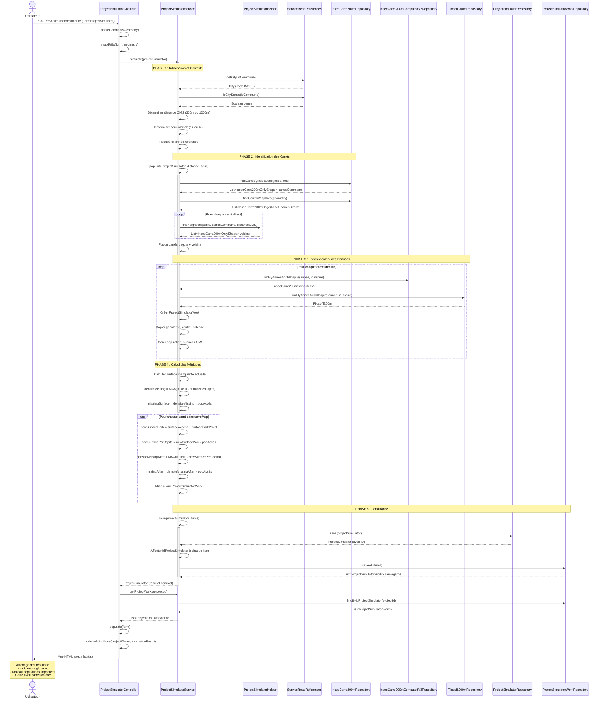

# Documentation du Simulateur de Projet

## Table des matières
1. [Introduction](#introduction)
2. [Partie Utilisateur - Création de Projet](#partie-utilisateur---création-de-projet)
3. [Service de Calcul](#service-de-calcul)
4. [Limites et Contraintes](#limites-et-contraintes)

---

## Introduction

Le **Simulateur de Projet** est un outil permettant de simuler l'impact d'un projet d'aménagement sur les surfaces d'espaces verts disponibles au sein d'une commune. Il calcule les propositions basées sur les données INSEE (carrés 200m x 200m) et les recommandations de l'Organisation Mondiale de la Santé (OMS).

### Objectifs principaux
- Évaluer l'impact d'un nouveau projet d'aménagement sur la disponibilité des espaces verts
- Calculer les surfaces de parc nécessaires par rapport aux recommandations OMS
- Identifier les populations affectées par le projet
- Visualiser géographiquement les zones d'impact

---

## Partie Utilisateur - Création de Projet

### 1. Sélection du Territoire

La création d'un projet se fait en trois étapes hiérarchiques :

#### 1.1 Sélection de la Région
- Choisir une région dans la liste déroulante
- Cette sélection active automatiquement les niveaux suivants

#### 1.2 Sélection de l'EPCI (Communauté de Communes)
- Une fois la région sélectionnée, choisir une communauté de communes
- Cette étape est désactivée tant qu'aucune région n'est sélectionnée

#### 1.3 Sélection de la Commune
- Saisir le nom de la commune dans le champ de recherche avec auto-complétion
- La carte se centre automatiquement sur la commune sélectionnée
- Les projets existants pour cette commune sont affichés dans le tableau

### 2. Consultation des Projets Existants

Un tableau liste tous les projets existants pour la commune sélectionnée avec :
- **Nom** : nom du projet (triable par clic sur l'en-tête)
- **Surface zone** : surface totale de la zone du projet (m² ou ha)
- **Population** : population estimée du projet
- **Surface parc** : surface de parc prévue (m² ou ha)
- **Action** : bouton "Éditer" pour charger le projet

**Fonctionnalités du tableau :**
- Tri par nom de projet
- Pagination (si plus de 10 projets)
- Message informatif si aucun projet n'existe

### 3. Création/Édition d'un Projet

#### 3.1 Paramètres du Projet

**Informations générales :**
- **Nom du projet** : identifiant unique du projet
- **Année** : année de référence pour les calculs (défaut: année en cours)
- **Type de zone** : case à cocher "Zone dense" (influence les calculs de distance OMS)

**Paramètres de densité :**
- **Densité par logement** : nombre moyen d'habitants par logement (ex: 2.16)
- **Surface moy. logement** : surface moyenne d'un logement en m² (ex: 68)

**Surfaces :**
- **Surface plancher** : surface totale plancher du projet en m²
- **Population estimée** : nombre d'habitants prévus
- **Surface de la zone** : surface totale de la zone d'aménagement en m² (calculée automatiquement depuis la carte)
- **Surface parc prévue** : surface d'espaces verts à créer en m²

#### 3.2 Définition Géographique du Projet

**Outils de dessin (Leaflet-Geoman) :**
- **Polygone** : dessiner une zone avec forme libre
- **Édition** : modifier les formes existantes
- **Suppression** : supprimer les formes dessinées

**Fonds de carte disponibles :**
- IGN Aérien (par défaut)
- Satellite (Esri)
- OpenStreetMap

**Couches d'information :**
- **Parcs existants** : visualisation des parcs déjà comptabilisés
  - Vert : parc inclus dans les calculs OMS
  - Orange : parc exclu des calculs OMS
  - Violet : parc futur ou détruit
- **Projets** : zone du projet en cours
- **Populations impactées** : carrés INSEE de 200m impactés (orange)

#### 3.3 Calcul de la Simulation

1. Remplir tous les paramètres nécessaires
2. Dessiner la zone du projet sur la carte
3. Cliquer sur le bouton **"Calculer"**
4. Les résultats s'affichent automatiquement en dessous du formulaire

### 4. Nouveaux Projets

Pour créer un nouveau projet :
1. Cliquer sur le bouton **"Nouveau"** dans l'en-tête "Paramètres du projet"
2. Le formulaire est réinitialisé
3. La commune reste sélectionnée
4. Saisir les nouveaux paramètres et dessiner la zone

---

## Service de Calcul

### 1. Architecture du Service

Le calcul de simulation est géré par la classe `ProjectSimulatorService` qui coordonne plusieurs composants :

#### 1.1 Composants Principaux

```
ProjectSimulatorController (Contrôleur MVC)
    ↓
ProjectSimulatorService (Logique métier)
    ↓
├── InseeCarre200mOnlyShapeRepository (Géométries des carrés)
├── InseeCarre200mComputedV2Repository (Données calculées)
├── Filosofil200mRepository (Données démographiques)
├── ProjectSimulatorRepository (Persistance projets)
└── ProjectSimulatorlWorkRepository (Persistance calculs)
```

### 2. Algorithme de Calcul

#### 2.1 Phase 1 : Initialisation et Contexte

1. **Récupération des informations de la commune**
   - Code INSEE de la commune
   - Détermination de la densité urbaine (zone dense ou non)

2. **Paramètres OMS selon la densité**
   - **Zone dense** :
     - Distance OMS : valeur configurée pour zone urbaine
     - Surface recommandée : valeur pour zone urbaine (m²/habitant)
   - **Zone non dense** :
     - Distance OMS : valeur configurée pour zone sub-urbaine
     - Surface recommandée : valeur pour zone sub-urbaine (m²/habitant)

3. **Année de référence**
   - Utilisation de la dernière année disponible dans les données INSEE

#### 2.2 Phase 2 : Identification des Carrés Impactés

```
Constante : SURFACE_CARRE = 40 000 m² (200m x 200m)
```

1. **Récupération des carrés de la commune**
   ```sql
   SELECT * FROM insee_carre_200m 
   WHERE insee_code = [code_commune] 
   AND valide = true
   ```

2. **Identification des carrés directement impactés**
   - Intersection géométrique entre la zone du projet et les carrés INSEE
   - Utilise la fonction PostGIS `ST_Intersects()`

3. **Calcul des carrés voisins à distance OMS**
   - Pour chaque carré directement impacté
   - Recherche des carrés voisins dans un rayon égal à la distance OMS
   - Utilise l'algorithme `ProjectSimulatorHelper.findNeighbors()`
   - Résultat : ensemble de tous les carrés affectés (directs + voisins)

#### 2.3 Phase 3 : Enrichissement des Données

Pour chaque carré identifié, récupération des données :

1. **Données géométriques** (`InseeCarre200mOnlyShape`)
   - ID INSPIRE du carré
   - Géométrie du carré
   - Point central du carré

2. **Données calculées** (`InseeCarre200mComputedV2`)
   - Population dans l'isochrone OMS : `populationInIsochroneOms`
   - Surface totale de parc accessible : `surfaceTotalParkOms`
   - Surface de parc par habitant : `surfaceParkPerCapitaOms`
   - Population totale du carré : `popAll`

3. **Données démographiques** (`Filosofil200m`)
   - Données de population détaillées
   - Année de référence

#### 2.4 Phase 4 : Calcul des Métriques de Proposition

Pour chaque carré, création d'un objet `ProjectSimulatorWork` contenant :

**Métriques initiales (avant projet) :**

1. **Surface manquante actuelle**
   ```
   densiteMissing = MAX(0, recoSquareMeterPerCapita - surfaceParkPerCapitaOms)
   missingSurface = densiteMissing × accessingPopulation
   ```
   - Si la surface actuelle par habitant est inférieure au seuil OMS
   - Calcul du déficit total en m²

2. **Surface accessible**
   ```
   accessingSurface = surfaceTotalParkOms
   ```
   - Surface totale de parc accessible depuis ce carré

3. **Population concernée**
   ```
   accessingPopulation = populationInIsochroneOms
   localPopulation = popAll
   ```
   - Population ayant accès aux parcs (dans l'isochrone OMS)
   - Population locale du carré

**Métriques après projet :**

4. **Nouvelle surface disponible**
   ```
   newSurfacePark = accessingSurface + surfaceParkProjet
   ```
   - Ajout de la surface du parc du projet à la surface existante
   - Le parc du projet bénéficie à tous les carrés impactés

5. **Nouvelle surface par habitant**
   ```
   newSurfacePerCapita = newSurfacePark / accessingPopulation
   ```
   - Si `accessingPopulation > 0`

6. **Nouvelle surface manquante**
   ```
   densiteMissingAfter = MAX(0, recoSquareMeterPerCapita - newSurfacePerCapita)
   missingAfter = densiteMissingAfter × accessingPopulation
   ```
   - Calcul du déficit résiduel après le projet

#### 2.5 Phase 5 : Persistance

1. **Sauvegarde du projet** (`ProjectSimulator`)
   - Tous les paramètres du projet
   - Géométrie de la zone
   - Centre de la zone (centroïde)

2. **Sauvegarde des calculs** (`ProjectSimulatorWork`)
   - Un enregistrement par carré impacté
   - Toutes les métriques calculées (avant et après)
   - Lien avec le projet via `idProjectSimulator`

#### 2.6 Résumé de l'Algorithme et Diagramme de Séquence

##### Synthèse des 5 Phases

L'algorithme de simulation se déroule selon un processus séquentiel en 5 phases principales :

| Phase | Nom | Entrées | Sorties | Objectif |
|-------|-----|---------|---------|----------|
| **1** | Initialisation | Code INSEE, ID commune | Densité urbaine, distance OMS, seuil m²/hab, année | Préparer les paramètres de calcul selon le contexte territorial |
| **2** | Identification | Géométrie projet, carrés commune | Liste carrés impactés (directs + voisins OMS) | Déterminer la zone d'influence du projet |
| **3** | Enrichissement | IDs INSPIRE des carrés | Données géométriques, démographiques et calculées | Collecter toutes les données nécessaires pour chaque carré |
| **4** | Calcul | Données carrés, surface parc projet | Métriques avant/après pour chaque carré | Évaluer l'impact du projet sur les indicateurs OMS |
| **5** | Persistance | Projet + liste métriques | Enregistrements BDD | Sauvegarder les résultats pour consultation ultérieure |

**Flux de données :** L'algorithme transforme progressivement les paramètres du projet (nom, surface, population, géométrie) en un ensemble de métriques détaillées par carré INSEE, permettant d'évaluer l'impact du projet sur la disponibilité d'espaces verts pour les populations concernées.

**Principe clé :** Le parc créé par le projet bénéficie à tous les carrés situés dans un rayon égal à la distance OMS (300m ou 1200m selon la densité), en s'ajoutant aux surfaces de parcs existantes déjà accessibles.

##### Diagramme de Séquence UML



##### Légende du Diagramme

**Participants principaux :**
- **Controller** : Point d'entrée HTTP, gère le formulaire et la vue
- **Service** : Cœur de la logique métier, orchestre les 5 phases
- **Helper** : Fonctions utilitaires (calcul voisinage)
- **RefService** : Service de référence (villes, densité, coordonnées)
- **GeoDB, ComputeDB, FiloDB** : Repositories pour données géographiques et démographiques
- **ProjectDB, WorkDB** : Repositories pour persistance des résultats

**Points clés :**
1. Le processus est **synchrone** : l'utilisateur attend la fin du calcul
2. La **phase populate()** encapsule les phases 2 et 3
3. Chaque carré est traité **individuellement** en phase 3 et 4
4. La persistance est **atomique** : projet + tous les WorkItems en une transaction
5. Le résultat est **immédiatement affiché** après sauvegarde

### 3. Formules et Calculs Détaillés

#### 3.1 Calcul de Population du Projet

```
population = (surfaceFloor / avgAreaAccommodation) × densityPerAccommodation
```

Où :
- `surfaceFloor` : surface plancher du projet en m²
- `avgAreaAccommodation` : surface moyenne d'un logement en m²
- `densityPerAccommodation` : nombre moyen d'habitants par logement

#### 3.2 Seuils OMS par Type de Zone

**Zone Dense (Urbaine) :**
- Distance recommandée : généralement 300m
- Surface recommandée : 12 m²/habitant

**Zone Non Dense (Sub-urbaine) :**
- Distance recommandée : généralement 1200m
- Surface recommandée : 45 m²/habitant

*Note : Ces valeurs sont configurables via `ApplicationBusinessProperties`*

#### 3.3 Calcul de Surface de Zone

La surface de la zone est calculée automatiquement :
```sql
SELECT ST_Area(geometry) FROM project_area
```
- Utilise PostGIS pour le calcul précis
- Prend en compte la projection WGS 84 (SRID-4326)
- Retour en mètres carrés

### 4. Résultats de Simulation

#### 4.1 Résumé Global

Affichage de 4 indicateurs principaux :
- **Population estimée** : nombre d'habitants du projet
- **Surface zone** : surface totale d'aménagement (m² ou ha)
- **Surface parc** : surface d'espaces verts créée (m² ou ha)
- **Densité** : densité par logement

#### 4.2 Tableau des Populations Impactées

Pour chaque carré INSEE impacté :

| Colonne | Description | Calcul |
|---------|-------------|--------|
| **Nom** | ID INSPIRE du carré | Identifiant unique |
| **Pop. locale** | Population du carré | Données Filosofil |
| **Pop. accès** | Population ayant accès aux parcs | Isochrone OMS |
| **Surf. accès** | Surface de parc accessible | Somme des parcs dans l'isochrone |
| **Surf. manquante** | Déficit actuel | `(seuilOMS - surfActuelle/hab) × popAccès` |
| **Surf./hab.** | Surface par habitant actuelle | `surfAccès / popAccès` |
| **Nouvelle surf.** | Surface après projet | `surfAccès + surfProjet` |
| **Nouv. surf./hab.** | Surface par habitant après projet | `nouvelleSurf / popAccès` |

**Codes couleurs :**
- Valeurs en rouge : déficit par rapport au seuil OMS
- Valeurs en vert : conforme ou supérieur au seuil OMS

---

## Limites et Contraintes

### 1. Limites Techniques

#### 1.1 Données Géographiques

**Résolution des carrés INSEE :**
- Granularité : 200m × 200m (40 000 m²)
- Les projets de petite taille (<10 000 m²) peuvent avoir des résultats imprécis
- Un carré peut être partiellement occupé mais compté au prorata

**Projection géographique :**
- Système de coordonnées : WGS 84 (SRID-4326)
- WGS 84 (World Geodetic System 1984) est un système géodésique mondial.


**Précision des géométries :**
- les carreaux INSEE ont une précision de ± 1m²
- Les tracés manuels peuvent manquer de précision
- Les intersections de polygones complexes peuvent générer des approximations
- La surface calculée dépend de la précision du dessin utilisateur

#### 1.2 Données Démographiques

**Année de référence :**
- Les données INSEE et Filosofil ont un décalage temporel (5 ans de données, centré au mileu)
- Dernière année disponible : configurable dans `ApplicationBusinessProperties`
- Les projections futures ne sont pas calculées automatiquement

**Population des carrés :**
- Les carrés sans population (zones industrielles, agricoles) sont exclus
- Les carrés avec données manquantes sont ignorés
- Pas de prise en compte de l'évolution démographique future

**Densité urbaine :**
- Classification binaire : dense / non dense
- Pas de gradation intermédiaire
- Basée sur les critères INSEE (peut ne pas refléter la réalité locale)

#### 1.3 Calculs et Algorithmes

**Distance OMS :**
- Calcul en distance euclidienne (à vol d'oiseau)
- la distance entre carreau proche est calculée avec la formule de Haversine
- Ne tient pas compte des obstacles (routes, bâtiments, rivières)
- Ne considère pas les distances réelles de marche

**Répartition des bénéfices :**
- Le parc du projet bénéficie uniformément à tous les carrés dans le rayon OMS
- Pas de pondération selon la distance réelle
- Pas de prise en compte de l'accessibilité effective

**Isochrones :**
- Calculs basés sur les isochrones piétons de 5 ou 20 minutes selon la densité
- Ne tient pas compte des variations de terrain

### 2. Limites Fonctionnelles

#### 2.1 Interface Utilisateur

**Dessin sur la carte :**
- Nécessite une manipulation précise des outils de dessin
- Risque d'erreurs si l'utilisateur dessine hors de la commune
- Pas de validation automatique des formes (ex: auto-intersection)

**Saisie des paramètres :**
- Aucune validation des valeurs cohérentes entre elles
- Exemple : population incompatible avec la surface plancher
- L'utilisateur doit vérifier la cohérence manuellement

**Édition des projets :**
- Impossible de modifier la géométrie d'un projet existant directement
- Nécessite de recharger et redessiner

#### 2.2 Gestion des Projets

**Unicité :**
- Pas de contrôle d'unicité du nom de projet par commune
- Possibilité de doublons

**Versionning :**
- Pas d'historique des modifications
- Une modification écrase les données précédentes

**Suppression :**
- Pas de fonction de suppression de projet dans l'interface
- Nécessite une intervention en base de données

**Statut :**
- Pas de workflow (brouillon, validé, archivé)
- Tous les projets ont le même statut

### 3. Limites Métier

#### 3.1 Recommandations OMS

**Application stricte :**
- Les seuils OMS sont appliqués uniformément
- Pas de prise en compte des spécificités locales
- Pas d'ajustement selon le contexte socio-économique

**Types d'espaces verts :**
- Pas de distinction entre types de parcs (urbain, périurbain, naturel)
- Tous les espaces verts sont traités de manière équivalente
- Pas de pondération qualitative

#### 3.2 Projets d'Aménagement

**Type de projet :**
- Uniquement des projets de logements avec espaces verts
- Pas de gestion de projets mixtes (commerces, bureaux)
- Pas de prise en compte des équipements publics

**Temporalité :**
- Pas de phasage des projets
- Calcul instantané (pas de projection dans le temps)
- Pas de cumul avec d'autres projets en cours

**Impact :**
- Seul l'impact positif (création de parc) est calculé
- Pas de prise en compte de la destruction d'espaces verts existants

### 4. Limites de Performance

#### 4.1 Volumétrie

**Nombre de carrés :**
- Pour les grandes communes : temps de calcul proportionnel au nombre de carrés
- Risque de ralentissement si >1000 carrés impactés
- Pas de pagination ou calcul asynchrone

**Géométries complexes :**
- Les polygones avec nombreux points ralentissent le rendu
- Les calculs d'intersection sont coûteux
- Recommandation : limiter à 100 points par polygone

#### 4.2 Affichage Cartographique

**Nombre de couches :**
- L'affichage simultané de nombreux carrés peut ralentir la carte
- Recommandation : masquer les couches non utilisées
- Zoom minimum : 10, zoom maximum : 18

**Rafraîchissement :**
- Pas de mise à jour automatique après calcul
- Nécessite un rechargement manuel de la page

### 5. Recommandations d'Usage

#### 5.1 Bonnes Pratiques

**Avant de créer un projet :**
1. Vérifier les données disponibles pour la commune
2. Consulter les projets existants pour éviter les doublons
3. Préparer les paramètres du projet à l'avance

**Lors de la saisie :**
1. Dessiner la zone du projet avec précision
2. Vérifier la cohérence des paramètres (population vs surface)
3. S'assurer que la zone dessinée correspond bien à la commune sélectionnée

**Interprétation des résultats :**
1. Analyser le tableau des populations impactées
2. Comparer les surfaces avant/après projet
3. Identifier les carrés avec le plus grand déficit
4. Considérer les résultats comme indicatifs et non définitifs

#### 5.2 Cas d'Usage Recommandés

**Adapté pour :**
- Études préliminaires de faisabilité
- Comparaison de plusieurs scénarios
- Évaluation rapide de l'impact
- Communication avec les parties prenantes

**Non adapté pour :**
- Études d'impact détaillées et réglementaires
- Décisions d'urbanisme définitives
- Calculs de conformité légale
- Projets hors France métropolitaine

### 6. Évolutions Futures Envisageables

**Amélioration des calculs :**
- Intégration de distances réelles (routing)
- Pondération selon la qualité des espaces verts
- Prise en compte de l'accessibilité PMR

**Gestion de projets :**
- Workflow de validation
- Historisation des modifications
- Gestion des droits d'accès

**Analyses avancées :**
- Cumul de plusieurs projets
- Projection temporelle
- Analyse coûts-bénéfices
- Export des résultats (PDF, Excel)

**Interface :**
- Import de géométries depuis fichiers (GeoJSON, Shapefile)
- Validation automatique des saisies
- Calcul en temps réel pendant le dessin
- Comparaison visuelle avant/après

---

## Annexes

### A. Glossaire

| Terme | Définition |
|-------|------------|
| **INSPIRE** | Infrastructure for Spatial Information in Europe - Identifiant unique européen |
| **INSEE** | Institut National de la Statistique et des Études Économiques |
| **Carré 200m** | Maille géographique normalisée de 200m × 200m (40 000 m²) |
| **Filosofil** | Fichier Localisé des Statistiques d'Origine et de Résidence - données démographiques INSEE |
| **OMS** | Organisation Mondiale de la Santé |
| **Isochrone** | Zone accessible dans un temps de déplacement donné |
| **Lambert 93** | Système de projection cartographique français (EPSG:2154) |
| **WGS 84** | Système de projection cartographique mondial |
| **EPCI** | Établissement Public de Coopération Intercommunale |
| **Surface plancher** | Surface de construction totale d'un bâtiment |

### B. Configuration Technique

**Propriétés configurables** (`ApplicationBusinessProperties`) :

```yaml
application:
  business:
    derniere-annee: 2029
    oms-urban-distance: 300
    oms-sub-urban-distance: 1200
    reco-urb-square-meter-per-capita: 12.0
    reco-sub-urb-square-meter-per-capita: 25.0
```

**Dépendances cartographiques :**
- Leaflet 1.9.x
- Leaflet-Geoman 2.x
- Fonds de carte : OSM, IGN, Esri

**Base de données :**
- PostgreSQL 15+
- PostGIS 3.0+
- Schéma : tables `project_simulator`, `project_simulator_work`, `insee_carre_200m_*`, `filosofil_200m`

### C. Points d'API REST

| Endpoint | Méthode | Description |
|----------|---------|-------------|
| `/mvc/simulation` | GET | Affiche la page du simulateur |
| `/mvc/simulation/region` | POST | Change la région sélectionnée |
| `/mvc/simulation/commDeCo` | POST | Change l'EPCI sélectionné |
| `/mvc/simulation/city` | POST | Change la commune sélectionnée |
| `/mvc/simulation/load` | GET | Charge un projet existant pour édition |
| `/mvc/simulation/compute` | POST | Lance le calcul de simulation |

---

**Version du document :** 1.0  
**Date de dernière mise à jour :** 5 janvier 2026  
**Auteur :** Documentation générée pour le projet GeoService-Isochrone
