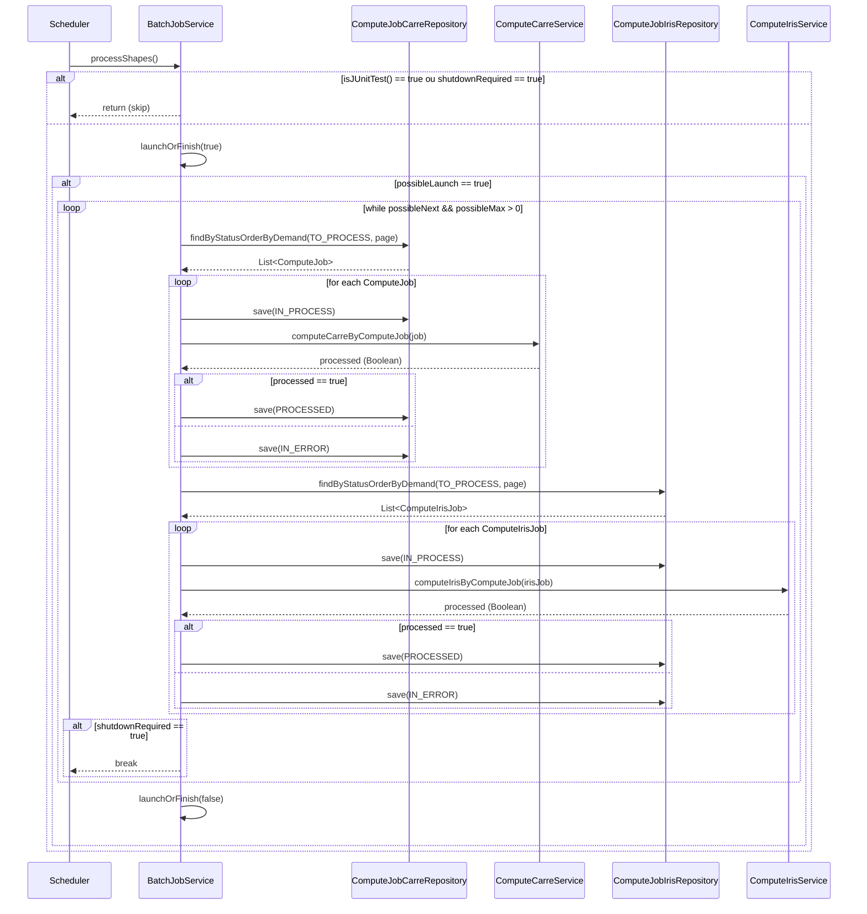

---

## Explication de la méthode `processShapes`

La méthode `processShapes` est une tâche planifiée (annotée avec `@Scheduled`) qui traite les entités "Carre" et "Iris" à partir de la base de données. Elle fonctionne par lots (pagination) et effectue les étapes suivantes :

1. **Vérifications initiales** :  
   - Ignore l'exécution si le contexte est un test JUnit ou si un arrêt est demandé (`shutdownRequired`).

2. **Gestion de la concurrence** :  
   - Utilise `launchOrFinish(true)` pour s'assurer qu'aucun autre traitement n'est en cours.

3. **Traitement des jobs "Carre"** :  
   - Récupère les jobs à traiter via le repository, selon l'environnement (dev ou prod).
   - Pour chaque job :
     - Marque le job comme "IN_PROCESS".
     - Appelle le service de calcul (`computeCarreService`).
     - Met à jour le statut selon le résultat (PROCESSED ou IN_ERROR).

4. **Traitement des jobs "Iris"** :  
   - Même logique que pour les "Carre", mais avec le repository et service dédiés aux "Iris".

5. **Arrêt anticipé** :  
   - Si un arrêt est demandé pendant le traitement, la boucle s'interrompt.

6. **Fin du traitement** :  
   - Appelle `launchOrFinish(false)` pour libérer le verrou de concurrence.

---

Ce diagramme et cette explication permettent de visualiser le flux d'exécution et les interactions principales de la méthode `processShapes` dans le service `BatchJobService`.

