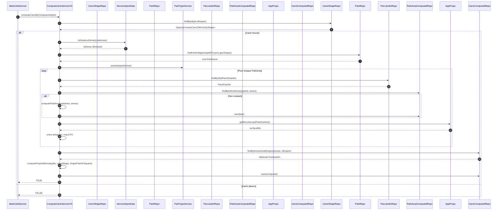

# Documentation: `ComputeCarreServiceV3.computeCarreByComputeJob`

Cette documentation décrit le déroulement fonctionnel et technique de la méthode `computeCarreByComputeJob` et du calcul interne réalisé par `computeCarreShape` dans le service `ComputeCarreServiceV3`.

## 1. Objectif
À partir d'un `ComputeJob` (contient `idInspire` et `annee`), le service :
1. Charge le carré INSEE 200m correspondant.
2. Détermine si la zone est dense (influence sur les distances d'accessibilité).
3. Identifie les parcs intersectant le carré.
4. Agrège leurs surfaces, statut OMS, et calcule des métriques population/surface.
5. Calcule les indicateurs de surface de parc par habitant (global et OMS).
6. Sauvegarde ou met à jour l'entité `InseeCarre200mComputedV2`.

## 2. Diagramme de séquence (Mermaid)

## 3. Détails des étapes internes
### 3.1 Chargement du carré
- Repository: `InseeCarre200mOnlyShapeRepository.findById(idInspire)`
- Interruption si absent.

### 3.2 Densité urbaine
- `ServiceOpenData.isDistanceDense(codeInsee)` influence la construction des isochrones.

### 3.3 Recherche des parcs
- `ParkAreaRepository.findParkInMapArea(WKT(shape))` renvoie les parcs intersectant le carré.
- `ParkTypeService.populate(List<ParkArea>)` enrichit chaque parc (type, règles OMS, surface, etc.).

### 3.4 Pré-calcul des parcs
Pour chaque parc :
- Vérification de l'activité annuelle : `isActive(parkArea, annee)` (dates début/fin via `ParcEtJardin`).
- Chargement ou calcul de `ParkAreaComputed` (méthode `computeParkArea`).
- Construction incrémentale des géométries agrégées (union géométrique) pour :
  - Tous les parcs.
  - Les parcs OMS.
  - Les parcs "suffisants" (surface ≥ reco `AppProps.getRecoAtLeastParkSurface()`).

### 3.5 DTO d'agrégation intermédiaire
L'objet `ComputeDto` consolide :
- Surfaces totales parc / parc OMS.
- Noms formatés des parcs (avec indicateurs ✓ / ✖).
- Polygones fusionnés (`union`).
- Population totale du carré.
- Marqueurs: `allAreOms`, `withSufficient`, `popWithSufficient`.

### 3.6 Calcul population et densité
`computePopAndDensity(dto, carreShape, shapeParkOnSquare)` :
- Cherche tous les carrés contenus dans l'agrégat d'isochrones.
- Pour chaque carré inclus : proratisation population = `(popCarre * surfaceIntersection / 40000)`.
- Calcule `surfaceParkPerCapita` = `surfaceTotalParks / populationInIsochrone` (et version OMS).
- Calcule population incluse / exclue selon accessibilité du parc.

### 3.7 Sauvegarde résultat
- `InseeCarre200mComputedV2` récupéré ou créé.
- Champs mis à jour: surfaces, population, per capita, commentaires, flags densité / durable.
- `inseeCarre200mComputedV2Repository.save(computed)`.

## 4. Principales entités et rôles
| Entité | Rôle |
|--------|------|
| `ComputeJob` | Contexte de calcul (annee, idInspire). |
| `InseeCarre200mOnlyShape` | Géométrie du carré 200m et point central. |
| `ParkArea` / `ParkAreaComputed` | Parc brut vs parc calculé (surface, population, OMS). |
| `ComputeDto` | Structure de travail interne regroupant surfaces, parcNames, géométries fusionnées. |
| `InseeCarre200mComputedV2` | Résultat persistant final pour le carré et l'année. |

## 5. Points d’extension / amélioration
- Optimiser recompute multi-années (TODO dans code: éviter recalcul années < 2027).
- Factoriser la logique de fusion géométrique (extraction utilitaire). 
- Gestion des exceptions plus fine (actuellement catch générique dans `computeCarreByComputeJob`).
- Ajout de métriques de performance (temps par carré, nombre d'unions géométriques).
- Cache sur densité (`isDistanceDense`) si appelée fréquemment pour un même INSEE.

## 6. Gestion des erreurs
| Étape | Risque | Stratégie actuelle |
|-------|--------|--------------------|
| Chargement carré | ID inexistant | Retourne FALSE. |
| Union géométrique | `TopologyException` | Catch global (améliorable). |
| Intersection surface | Géométrie invalide | Dépend de JTS (journalisation possible). |

## 7. Performance et volumétrie
- Boucles principales : nombre de parcs intersectant un carré (généralement modéré).
- Opérations coûteuses : `union` et `intersection` sur `Geometry` (JTS).
- Proratisation population proportionnelle au nombre de carrés touchés par isochrones fusionnés.

## 8. Résumé rapide du flux
1. Charger carré.
2. Décider densité.
3. Récupérer parcs + typer.
4. Préparer surfaces agrégées.
5. Calculer population accessible.
6. Persister résultat final.

## 9. Retour de la méthode
- TRUE si le calcul est terminé avec succès.
- FALSE si le carré n'existe pas ou erreur levée.

---
Dernière mise à jour : génération automatique de documentation.
